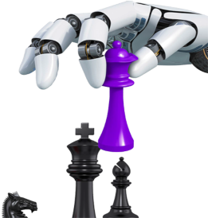

Our design and development team has a wealth of experience with building web properties and designing software. Our primary focus is leveraging our experience to provide tailored digital experiences that capture the essence of your business.

<h3 class="major">Experienced, Professional, Accomplished</h3>

Over the years, our team has gathered a wealth of experience from a myriad of web and software projects. Across industries, from entertainment and sports, to healthcare and regulated industries, the one constant is a proven track record of success. Previous client work includes the NFL, Warner Bros, Daimler, Thomson Reuters, and Blue Cross/Blue Shield. We have also worked with local businesses in the e-commerce, retail, service, automotive and medical sectors. 

We are building, updating and revamping websites, creating mobile apps and bringing many years technical expertise to every project we are engaged in. After many successful launches and project retrospectives, our team is experienced in common pitfalls that delay software projects and how to mitigate them.

<h3 class="major">Delivering a Unique Digital Journey to Each Client</h3>

Each web and mobile project, each digital journey, has a unique path and outcome. At 5L's Technologies, we focus on bringing a professional approach, proven technical acumen, and a personal touch every time. Whether it's a migration and design update to an existing site, a brand new design, or that dream mobile app idea that would affect positive change in the world. Our team is here to guide and support your needs and transform your customers' experience. 

